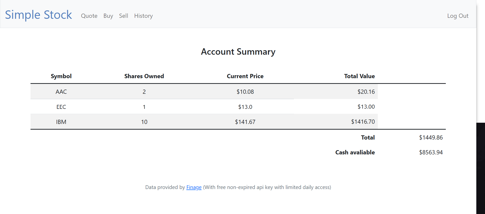

# Simple Stock Web-Application

This web-app is a simple virtual US stock portfolio. Users can sigh up then log in into the portfolio which has functionality to Qoute Buy and Sell wanted amount of shares. User might need to find the stock symbol from other site first before reassuring avialability in the app by qouting then use that symbol to buy any amount of shares. The "Qoute" functionality use flask alone to catch data from an API of Finage provider.

 -  Frontend: Python:Flask (HTML Templates and JinJa)
 -  Backend: Flask (Querying database/ authenticating/ API data catching)
 -  Database: Sqlite

LIVE DEMO: http://simplestock.devvianto605.info

** Live demo running on an AWS EC2 instance free tier using Ubuntu OS: Gunicorn+NginX **
